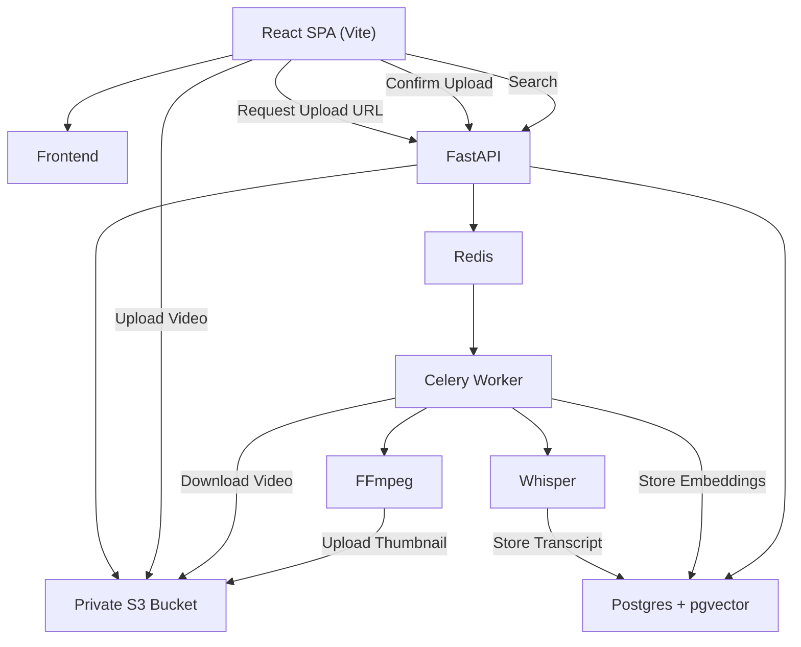
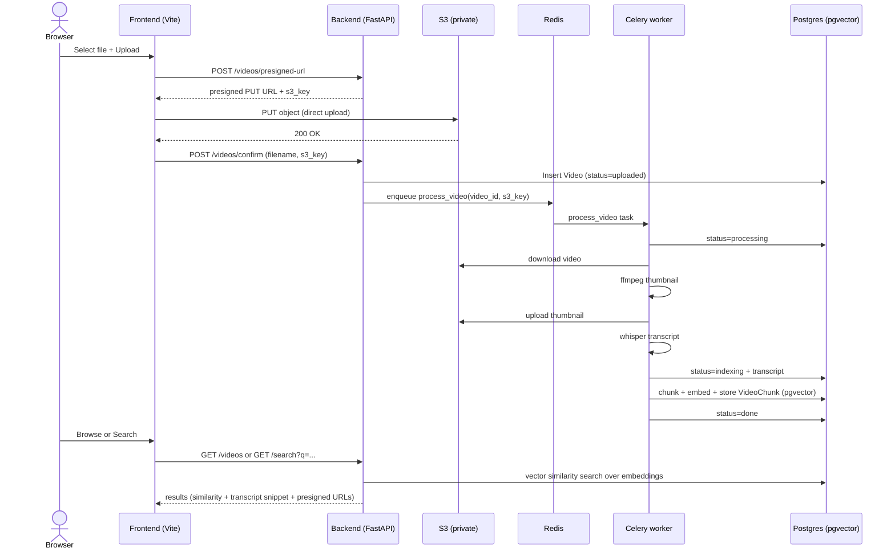

# AI Video Platform

Upload videos directly to a private S3 bucket, process them asynchronously (thumbnail + Whisper transcript), store transcript chunks in a PostgreSQL + pgvector database, and enable semantic search over video transcripts.

## Features
- **Direct-to-S3 uploads** using **FastAPI-generated presigned PUT URLs**
- **Asynchronous processing** with **Celery + Redis**
- **Thumbnail generation** using **FFmpeg**
- **Speech-to-text transcription** using **OpenAI Whisper**
- **Transcript chunking + embeddings** stored in **Postgres (pgvector)**
- **Semantic search** endpoint over transcript chunks
- **Secure playback** using **temporary presigned GET URLs**
- Dockerized multi-container local development setup

---

## Tech Stack
- **Frontend:** React + Vite
- **API:** FastAPI (Python)
- **Async workers:** Celery Worker (Python)
- **Database:** PostgreSQL 15 + **pgvector**
- **Message broker:** Redis
- **Storage:** AWS S3 (private bucket; access via presigned URLs)
- **Media processing:** FFmpeg
- **Transcription:** Whisper
- **Embeddings:** see `backend/embeddings.py`

---

## Architecture

### High-level system diagram (Mermaid)

> GitHub renders Mermaid diagrams inside fenced code blocks.



### End-to-end flow (Upload → Processing → Search)



---

## Backend API

Base URL: `http://localhost:8000`

### Upload
- `POST /videos/presigned-url`
  - Request: `{ "filename": string, "content_type": string }`
  - Response: `{ "url": string, "key": string }`

- `POST /videos/confirm`
  - Request: `{ "filename": string, "s3_key": string }`
  - Response: `{ "id": number, "status": string }`
  - Behavior: creates a `Video` row and enqueues the Celery task.

### Playback / browsing
- `GET /videos`
- `GET /videos/{video_id}`
  - Returns a **temporary presigned GET URL** for the video and thumbnail.

### Delete
- `DELETE /videos/{video_id}`
  - Deletes DB record and corresponding S3 objects.

### Semantic search
- `GET /search?q=...&limit=10`
  - Uses pgvector cosine distance over transcript chunk embeddings.

### Health
- `GET /health`
- `GET /redis-health`

---

## Environment variables

The backend and worker load a root `.env`.

Required:
- `AWS_REGION`
- `AWS_ACCESS_KEY_ID`
- `AWS_SECRET_ACCESS_KEY`
- `S3_BUCKET_NAME`
- `DATABASE_URL`
- `REDIS_URL`
- `OPENAI_API_KEY`

> Do not commit real secrets. Prefer committing a `.env.example`.

---

## Local development (Docker Compose)

From the project root:

```bash
docker compose up --build
```

After startup:
- Frontend: `http://localhost:5173`
- Backend health: `http://localhost:8000/health`

---

## How to make a good architecture diagram (quick checklist)
1. **Start with boundaries**: Client / API / Worker / Data stores / External services (S3).
2. **Show security**: mark S3 as private and show presigned URL access.
3. **Pick one purpose per diagram**: request flow OR data flow.
4. **Label the protocols**: endpoints, presigned PUT/GET, Celery task enqueue/run.
5. **Keep Mermaid simple**: short labels, no special characters that break parsing.

---

## Troubleshooting
- **Celery tasks don’t run**: verify `REDIS_URL` and Redis container health.
- **Status stuck in processing**: check worker logs; failures are marked as `status="error"`.
- **Search returns nothing**: confirm embeddings were generated and `VideoChunk` rows exist.
- **Video playback fails**: verify S3 permissions used to generate presigned GET URLs.

---

## License
Add your license here (e.g., MIT).

