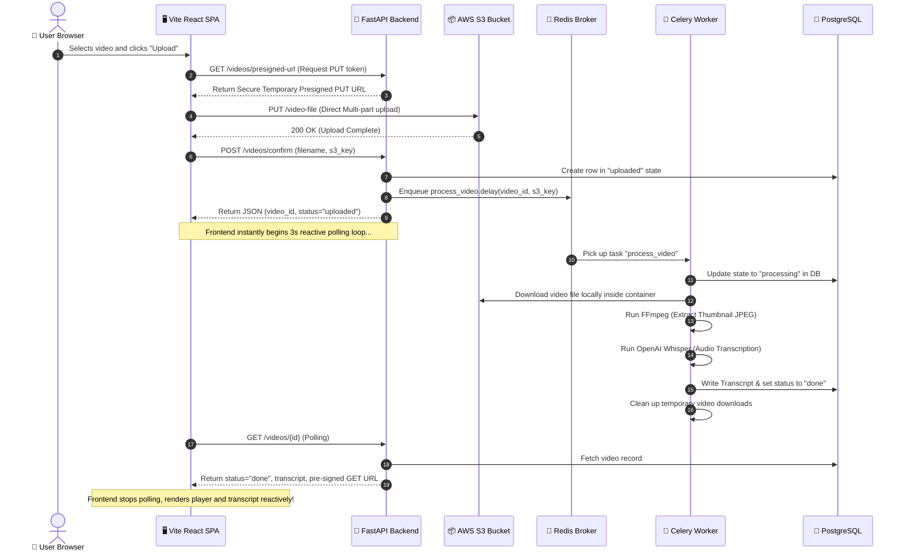

# AI Video Platform - Architecture & Data Flow

This document details the multi-container system architecture, secure networking, and asynchronous task flow of the containerized **AI Video Platform**.

---

## 🎛️ System Architecture Diagram

```mermaid
graph TD
    %% Define Nodes and Subgraphs
    subgraph Host ["User Browser & Client (Host OS)"]
        Browser["🖥️ React SPA Client<br>(Port 5173)"]
    end

    subgraph Cloud ["Amazon Web Services (AWS)"]
        S3["📦 Private S3 Bucket<br>(Secure Object Storage)"]
    end

    subgraph DockerBridge ["Docker Isolated Network (video_network)"]
        Frontend["🐳 React Frontend Container<br>(Node 20 / Port 5173)"]
        
        Backend["🐳 FastAPI Backend Container<br>(Python 3.10 / Port 8000)"]
        
        Worker["🐳 Celery Background Worker<br>(Python 3.10 + FFmpeg)"]
        
        DB[("🐳 PostgreSQL Container<br>(Postgres 15 / Port 5432)")]
        
        Broker[("🐳 Redis Message Broker<br>(Redis 7.2 / Port 6379)")]
    end

    %% Network & Request Connections
    Browser -->|1. Request SPA page| Frontend
    Browser -->|2. Secure Presigned PUT Upload| S3
    Browser -->|3. Confirm Upload API / GET Poll| Backend
    
    Backend -->|Alembic Migrations / Queries| DB
    Backend -->|Push Task (process_video.delay)| Broker
    
    Worker -->|Listen / Pull Tasks| Broker
    Worker -->|Fetch Video File| S3
    Worker -->|FFmpeg (Extract Thumbnail)<br>Whisper (Speech-to-Text)| Worker
    Worker -->|Save Transcript & Done Status| DB

    %% Volumes
    DB --- postgres_vol[("💾 postgres_data (Volume)")]
    Broker --- redis_vol[("💾 redis_data (Volume)")]
    Worker --- host_uploads[("📂 ./backend/uploads & ./backend/thumbnails")]
    Backend --- host_uploads
```

---

## 🔄 End-to-End Upload & Processing Flow

The diagram below details the exact step-by-step sequence when a user uploads a video file:



---

## 🔒 Security & Network Isolation Highlights

1. **Docker Bridge Isolation (`video_network`)**:
   * Services like `db` (Postgres) and `redis` (Redis broker) are highly isolated. While they expose standard ports to the host machine for utility management, backend-to-broker and worker-to-db handshakes occur exclusively inside the virtual network using Docker DNS names (`db:5432`, `redis:6379`), making traffic completely private.
2. **Private S3 Objects & Dynamic Pre-signed URLs**:
   * The Amazon S3 bucket remains locked down and strictly private. 
   * Browsers cannot fetch raw S3 file links due to security blocks. Instead, when a user views a video, the **FastAPI API server** uses AWS credentials inside the container to compile a dynamic **Pre-signed GET URL** valid for exactly **1 hour**. The browser plays the video securely without credentials ever leaking to the client or saved directly to the database.
3. **Data Durability**:
   * Database data is securely bound to the Docker host folder using persistent named volumes (`postgres_data`), ensuring that stopping, starting, or rebuilding containers will **never** wipe your catalog, thumbnails, or transcript records.
